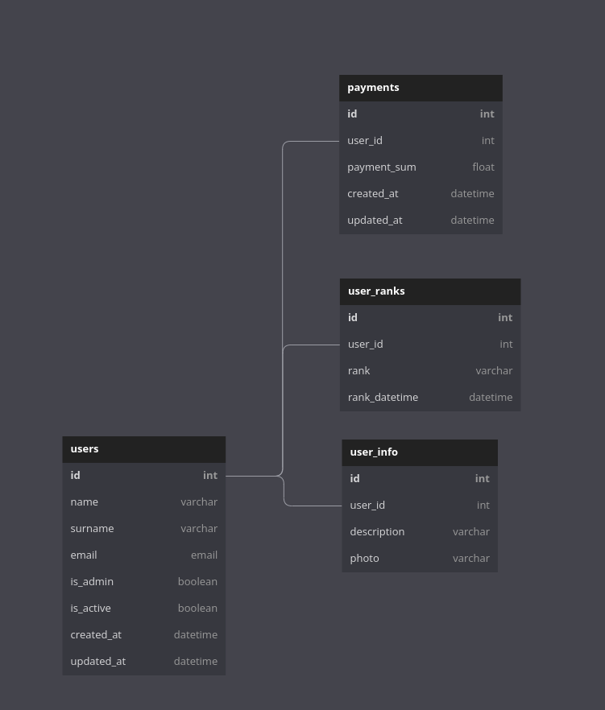

# Jiujitsu application - backend 

This project houses codes that handle the backend of the jiujitsu application. 

The backend logic is written in `Node.JS` and `Express` framework.

To learn more about the frameworks visit: 

- [Node.JS](https://nodejs.org/en/about)

- [Express](https://expressjs.com/)

# NODE js setup

To setup the project, you need to have `Node.JS` installed on your machine.

To install `Node.JS` visit [Node.JS](https://nodejs.org/en/download) and follow the instructions.

The command to initialize the project is `npm init`. This will create a `package.json` file that will contain all the dependencies of the project.

To install all the necessary dependencies, run the command `npm install`.

# Database schema

The database used in this project is postgresql. The schema is as follows:



# API endpoints

## Users 

---
```
POST /api/users/create 
```
Creates a new user. 

---

```
GET /api/users/:id
```

Gets a specific user by id. 

---
```
GET /api/users
```

Gets all users. 

---
```
DELETE /api/users/:id
```

Deletes a specific user by id. 

---
```
PUT /api/users/:id
```

Updates a specific user by id. The request body should contain the fields to be updated. For example, 

```
{
    "is_active": true, 
    "is_admin": false
}
```